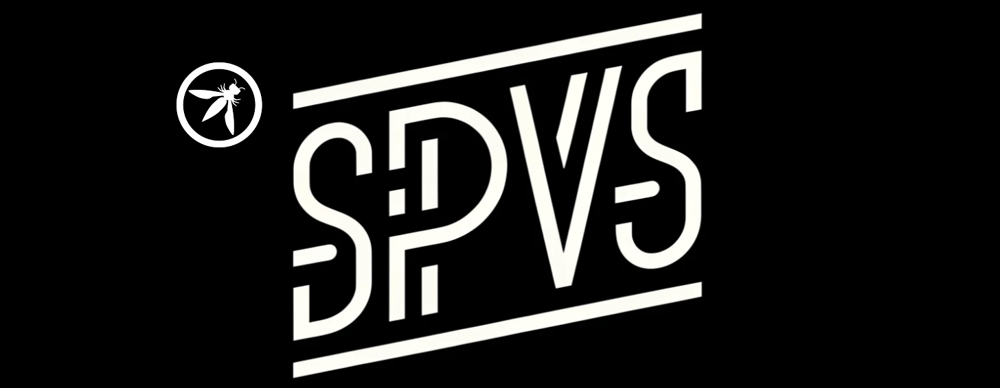

---

layout: col-sidebar
title: Secure Pipeline Verification Standard (SPVS)
tags: spvs
level: 4
type: standards
pitch: The Secure Pipeline Verification Standard (SPVS) Project goal is to develop a comprehensive standard that guides organizations in creating and maintaining secure software pipelines, encompassing the entire development and deployment lifecycle.
headerimage: ./assets/images/SPVS_Banner.png

---

## SPVS Overview:

The SPVS is a detailed guide containing a robust set of controls designed for software engineers, DevOps/DevSecOps engineers and security teams. It aims to assess and enhance the security maturity of software development pipelines, with a focus on managing the risks associated with code and artifact handling throughout the entire pipeline lifecycle, from inception to delivery.

## Key aspects of the guide will include:

1. Multilevel Control Framework: The guide will present a tiered structure of controls, catering to various levels of expertise and security needs. This will enable organizations to implement appropriate measures based on their current maturity and progress towards more advanced pipeline security practices.
2. Progressive Implementation Pathway: A clearly defined, step-by-step pathway will be outlined, guiding users from fundamental to sophisticated security implementations. This ensures a practical and scalable approach for improving pipeline security over time.
3. Customizable and Adaptable Controls: The guide will offer flexible controls that can be tailored to diverse software development environments. This adaptability ensures the relevance and applicability of the guide across different operational models and methodologies used in code and software management.
4. Comprehensive Coverage: The guide will encompass a wide range of topics, including secure code management, artifact integrity, automation of security tasks within the CI/CD pipeline, compliance monitoring, and incident response strategies.
5. Actionable and Dynamic Resource: The primary goal is to provide a dynamic, actionable resource that not only assesses but also significantly improves the security posture of software development pipelines in organizations of varying sizes and complexities.

SPVS will serve as a critical tool for organizations seeking to strengthen their software pipeline security, providing clear, actionable controls and a framework for concontinuous security improvement.

## Description of SPVS:
The Secure Pipeline Verification Standard (SPVS) framework is centered around security-focused requirements designed to safeguard software pipelines from inception to deployment. This framework is crafted to provide critical insights and actionable guidance for defending against emerging threats in software management, development, and distribution. It adopts a multi-tiered approach, offering a graduated pathway from fundamental to advanced security levels. This allows organizations to establish a foundational security baseline and progressively advance to best-in-class security practices tailored to their software delivery methods. The framework is structured to be both comprehensive and adaptable, ensuring relevance and effectiveness in diverse operational environments.

## Key Objective:

To develop a comprehensive standard that guides organizations in creating and maintaining secure software pipelines, encompassing the entire development and deployment lifecycle.

## Goal:

Our goal is to furnish a suite of controls aimed at significantly reducing the risk of attacks on software development pipelines, thereby enhancing the overall security posture of software delivery processes.

## Resources
* [GitHub Link](https://github.com/OWASP/www-project-spvs)
* [How to Contribute](https://github.com/OWASP/www-project-spvs/blob/main/CONTRIBUTING.md)